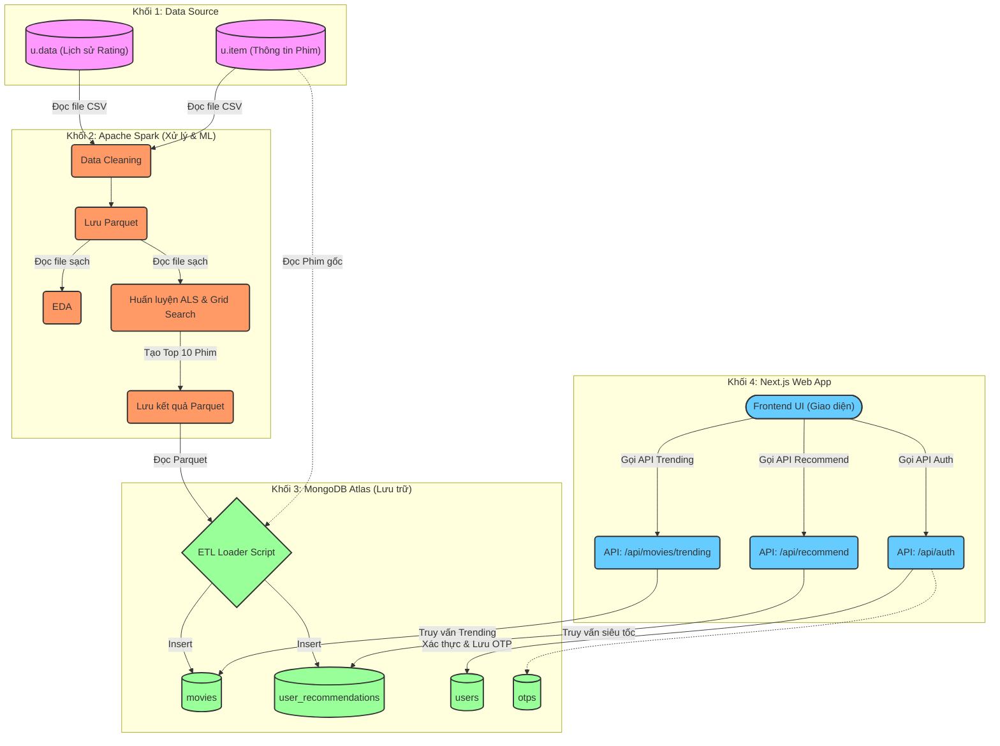
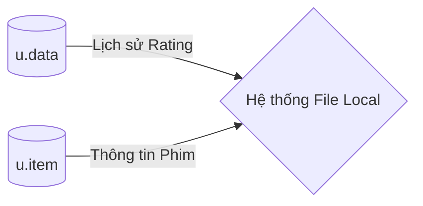
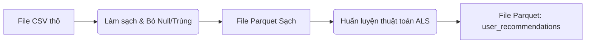
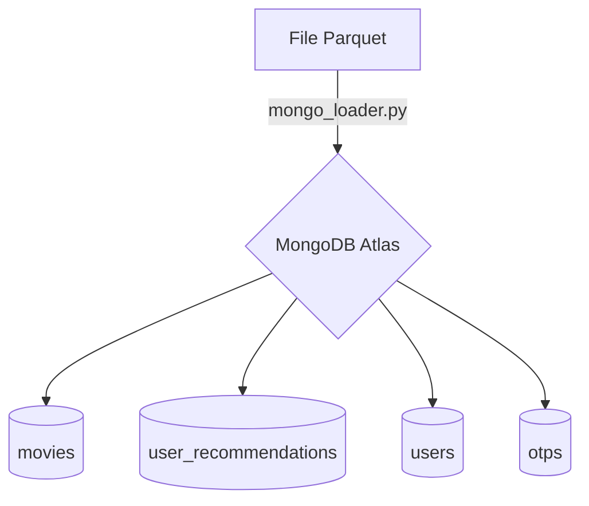
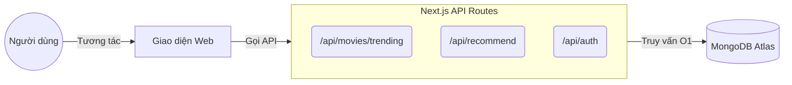

# KIẾN TRÚC HỆ THỐNG (SYSTEM ARCHITECTURE)

Dưới đây là sơ đồ kiến trúc hệ thống trực quan và chi tiết phân tích từng khối của dự án. Hệ thống hoạt động theo mô hình **Batch Processing Pipeline (Xử lý theo lô)** đối với phần AI, kết hợp với **Web Application (Ứng dụng trực tuyến)** đối với phần giao diện người dùng.

## Sơ Đồ Luồng Hoạt Động (Flowchart)

*Bạn có thể copy đoạn code sinh ra sơ đồ này dán thẳng vào Draw.io (chọn mục Thêm > Nâng cao > Mermaid) để nó tự động vẽ ra luôn nhé!*

---

## Phân tích Chi tiết 4 Khối (Modules)

### 1. Khối Dữ liệu nguồn (Data Source)
*Đây là nơi xuất phát của dữ liệu thô ban đầu.*

- **Đầu vào:** Tập dữ liệu MovieLens 100K dạng file Text/CSV (`u.data` chứa lịch sử rating, `u.item` chứa thông tin bộ phim).
- **Lưu trữ:** Local File System (Thư mục `/data` trên máy tính).

### 2. Khối Xử lý & Phân tích Dữ liệu (Data Processing & ML - Apache Spark)
*Đây là "bộ não" tính toán nặng (Heavy Lifting) của hệ thống. Chạy ngầm (Offline) định kỳ để tạo ra dữ liệu thông minh.*

- **Công nghệ lõi:** Apache Spark (PySpark), Spark SQL, Spark MLlib.
- **Tiểu module 2.1 - Làm sạch (Data Cleaning):** Đọc file thô -> Định nghĩa Schema -> Drop Null -> Drop Duplicates -> Lưu ra định dạng nén cột **Parquet**.
- **Tiểu module 2.2 - Khám phá (EDA):** Đọc file Parquet -> Phân tích thống kê -> Vẽ biểu đồ trực quan hóa (Matplotlib/Seaborn).
- **Tiểu module 2.3 - Huấn luyện mô hình (Model ALS Training):**
  - **Input:** File Rating Parquet sạch.
  - **Xử lý:** Thuật toán ALS (Alternating Least Squares) + Grid Search (Tuning tham số Rank, maxIter, RegParam).
  - **Output:** Suy luận và dự đoán Top 10 phim xuất sắc nhất cho toàn bộ 943 User -> Ghi đè kết quả ra file **Parquet**.

### 3. Khối Lưu trữ & Phân phối (Serving Layer - MongoDB)
*Làm cầu nối trung gian lưu trữ kết quả tính toán của AI để phục vụ Ứng dụng Web truy vấn tốc độ cao.*

- **Công nghệ lõi:** MongoDB Atlas (Cloud NoSQL Database).
- **Tiểu module 3.1 - ETL Loader (`mongo_loader.py`):** Script Python đọc file Parquet (chứa kết quả dự đoán của ML) -> Join với bảng dữ liệu phim -> Biến đổi thành JSON lồng nhau (Embedded Document) -> Đẩy lên Cloud MongoDB.
- **Tiểu module 3.2 - Database Collections:** 
  - `movies`: Danh mục thông tin phim (đã tích hợp Thể loại).
  - `user_recommendations`: Chứa mảng 10 phim gợi ý đã được tính toán sẵn (Pre-calculated) cho từng user cụ thể.
  - `users`: Quản lý tài khoản đăng nhập web, lưu trữ thông tin User và sở thích.
  - `otps`: Lưu trữ mã OTP dùng cho luồng xác thực đăng ký / đăng nhập của người dùng.

### 4. Khối Ứng dụng người dùng (Web Application)
*Đây là phần tương tác trực tiếp với End-User theo thời gian thực (Online).*

- **Công nghệ lõi:** Next.js (React), Tailwind CSS, Context API.
- **Tiểu module 4.1 - Backend API (Next.js Route Handlers):**
  - `/api/auth`: Xử lý đăng nhập, mã hóa mật khẩu, lưu thông tin sở thích thể loại phim của User mới đăng ký.
  - `/api/recommend`: Nhận `userId` và `genre` (nếu có) từ Client -> Truy vấn tốc độ cao vào MongoDB lấy mảng `user_recommendations` -> Lọc theo thể loại phim (Genre Filtering) và trả về kết quả JSON siêu mượt.
  - `/api/movies/trending`: API độc lập lấy ra danh sách các phim phổ biến nhất (Top 5 phim thịnh hành), hỗ trợ query lọc thẳng bằng thể loại qua `?genre=...`.
- **Tiểu module 4.2 - Frontend UI (Giao diện):**
  - **Login Modal:** Form đăng nhập có chức năng chọn **18 Thể loại phim (Genres)** dành cho người dùng mới (Cold Start).
  - **Dashboard:** Trang chủ tích hợp bộ lọc Thể loại, hiển thị trực quan 2 phần: **"Top 5 phim thịnh hành nhất"** (cố định / theo thể loại) và **"Top 5 phim bạn có thể thích"** (cá nhân hóa theo User ID + Thể loại). Đã được tối ưu thiết kế Glassmorphism cực kỳ hiện đại.
